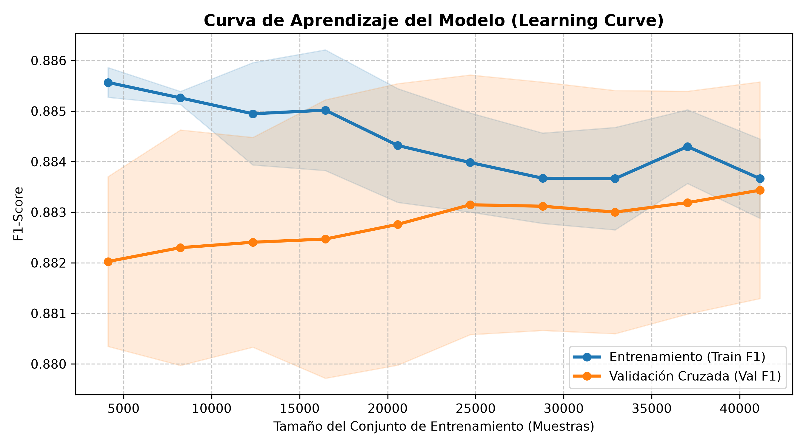
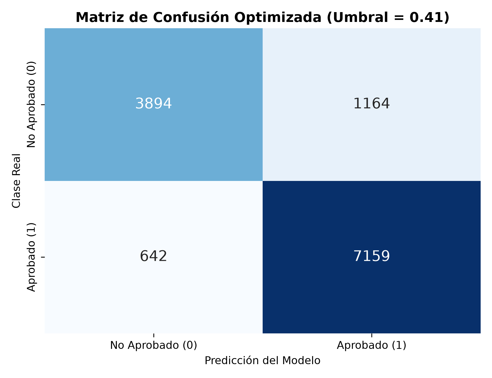
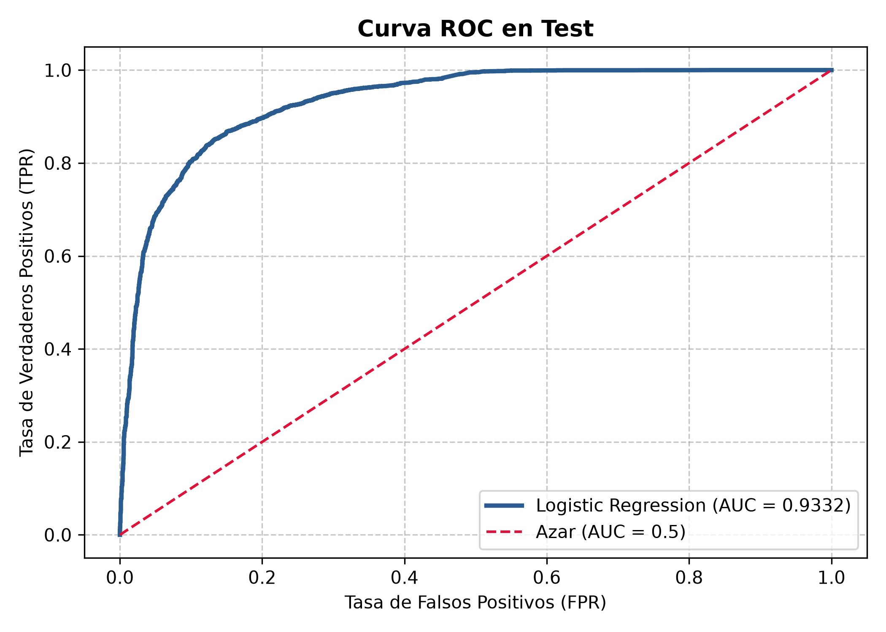
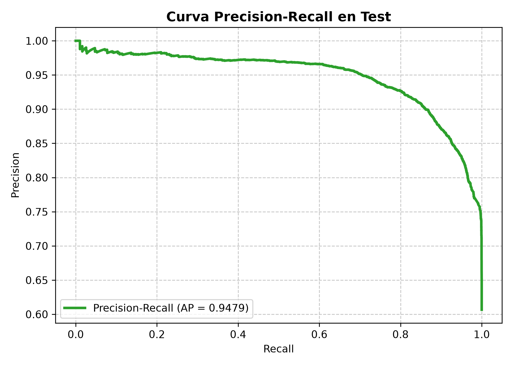

# Trabajo Práctico 2 (TP2) - Preprocesamiento de Datos y Regresión Logística Aplicada en FIUNA

### Machine Learning 1 (23433)
#### Facultad de Ingeniería - Universidad Nacional de Asunción (FIUNA)

---

## Objetivos del Trabajo Práctico

1. Comprender y aplicar metodologías de **preprocesamiento de datos de integridad** sobre registros masivos de rendimiento académico estudiantil (`reglamento_nuevo_unificado.csv`).
2. Mapear siglas curriculares e intensificaciones a las 7 carreras principales de la FIUNA sin pérdida destructiva de datos.
3. Formular y responder a 6 preguntas estadísticas exploratorias de retención, firmas y tasas de aprobación por carrera.
4. Construir un **Pipeline robusto de Machine Learning** en Scikit-Learn incorporando imputación mediana, interacciones polinomiales de 2º grado (`PolynomialFeatures`), escalado (`StandardScaler`) y codificación categórica (`OneHotEncoder`).
5. Resolver el desbalance de clases mediante `class_weight='balanced'` y optimizar hiperparámetros ($C$) vía `GridSearchCV`.
6. Evaluar el modelo mediante **Curvas de Aprendizaje (`learning_curve`)**, optimización del umbral de decisión ($	au^*$), Matriz de Confusión, Curva ROC (AUC) y Curva Precision-Recall.

---

## Estructura del Trabajo Práctico

El trabajo práctico se divide en dos cuadernos interactivos independientes:

| Parte | Cuaderno Práctico | Descripción |
| :--- | :--- | :--- |
| **Parte 1** | `nb_tp2_parte1_preprocesamiento.ipynb` | Carga de datos, mapeo de las 27 siglas de carreras, limpieza no destructiva (100% de retención de filas) y resolución de las 6 Preguntas Estadísticas Exploratorias. |
| **Parte 2** | `nb_tp2_parte2_regresion_logistica.ipynb` | Partición estratificada Train/Test (80/20), diseño del Pipeline con `PolynomialFeatures`, entrenamiento con `LogisticRegression`, Curvas de Aprendizaje, optimización de umbral y matriz de confusión. |

---

## Parte 1: Preprocesamiento y Análisis Estadístico Exploratorio

En esta primera fase se realiza la auditoría de integridad sobre los **64,295 registros** del reglamento unificado de la FIUNA.

### Preguntas Estadísticas Exploratorias
Los estudiantes deben implementar el código en Python para responder cuantitativamente a las siguientes 6 interrogantes:

1. **¿Cuántos estudiantes presentan registros en los tres ciclos del CSV?**: Conteo de alumnos únicos (`ALUMNO_ID`) presentes en los 3 ciclos académicos registrados.
2. **¿Cuántas personas/registros tienen calificación final (`Nota.Final`)?**: Evaluación de registros y personas con nota asignada en exámenes finales.
3. **¿Cuántos tienen proceso (`FirmaCalculada` / `Firma`)?**: Conteo de alumnos habilitados para examen final con Firma $\ge 50$.
4. **¿Cuál es la tasa de aprobación global y por Carrera?**: Distribución porcentual de éxito académico ($y=1$) en cada una de las 7 carreras de la FIUNA.
5. **¿Cómo se comparan las notas medias del 1er y 2do Parcial según condición final?**: Comparación de medias y desviaciones estándar de parciales entre estudiantes aprobados ($y=1$) y reprobados ($y=0$).
6. **¿Cuál es la tasa de abandono / inasistencia total a parciales?**: Registros que presentan 0 puntos o ausencia en ambos parciales.

---

## Parte 2: Regresión Logística, Curva de Aprendizaje y Evaluación de Desempeño

En la segunda fase se entrena y evalúa el modelo predictivo de regresión logística garantizando que no exista fuga de datos (*data leakage*).

### Curva de Aprendizaje del Modelo (Learning Curve)
Demuestra la convergencia del F1-Score a medida que aumenta el tamaño del conjunto de entrenamiento:

### Matriz de Confusión Optimizada
Muestra la clasificación en el conjunto de prueba (12,859 muestras) tras optimizar el umbral de decisión ($	au^* pprox 0.41$):

### Evaluación de Rendimiento Predictivo (Curvas ROC y Precision-Recall)

| Curva ROC (AUC = 0.9331) | Curva Precision-Recall (AP = 0.9412) |
| :---: | :---: |
|  |  |

---

## Instrucciones para la Entrega

1. Clonar el repositorio oficial de la materia y posicionarse en la rama del trabajo práctico.
2. Abrir los cuadernos `TP_2/nb_tp2_parte1_preprocesamiento.ipynb` y `TP_2/nb_tp2_parte2_regresion_logistica.ipynb` en **Antigravity IDE** o Jupyter Lab dentro del entorno `ml`.
3. Completar los bloques de código indicados con `# TODO: Completar código...` y `# === ESCRIBE TU CÓDIGO AQUÍ ===`.
4. Ejecutar todas las celdas, verificar que los gráficos y salidas se generen correctamente, guardar los cambios y realizar el commit/push correspondiente a tu repositorio en GitHub.

---

## Evaluación y Criterios de Calificación

| Componente | Ponderación | Criterios de Evaluación |
| :--- | :---: | :--- |
| **Parte 1: Preprocesamiento y Estadística** | **35%** | Mapeo correcto de las 27 siglas de carreras, limpieza no destructiva y precisión en el cálculo de las 6 preguntas estadísticas. |
| **Parte 2: Regresión Logística y Evaluación** | **65%** | Construcción adecuada del Pipeline de Scikit-Learn, graficación de la Curva de Aprendizaje, optimización del umbral y análisis de la Matriz de Confusión. |

---
